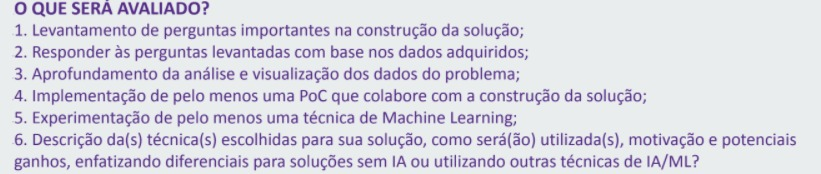

# Datasets & Jupyter notebooks about news predictions and recommendations
> Link pra instalar o projeto
* o conda [Anaconda Download](https://www.anaconda.com/products/individual)
* o scikit-learn  [scikit-learn](https://scikit-learn.org/stable/install.html)
* o  [Seaborn](https://seaborn.pydata.org/installing.html)
* obs:*O Pandas e Numpy vem instalado com conda*
******
## Link do notebooks
> [Recomendador por Leitura Atual](Projetos_SysRec.ipynb)
> [Predição por lista de leituras](Prediction%20on%20read%20news%20by%20individual.ipynb)
> [CSV para TfidfVectorizer](headlines.csv)
> [CSV para Knn](saitama.csv)
----
> O que será avaliado
> 
1. Qual a noticia que o jovem leria baseando na suas leituras atuais
2. R: O nosso algoritmo vai prever on-the-fly qual a preferencia do usuario baseado no que ele leu/visualizou
3. Nos aprofundamos para não só encontrar similaridades de conteudos de noticias, mas tambem predizer se dados uma lista de leitura de um usuario, ele leria uma determinada noticia ou não.
4. Implmentamos dois modelos funcionais, um que recomenda baseado na leitura atual, usando pesos de TF-IDF para os valores ou tags da noticia iex: Financas, tech, etc... . E uma que baseado nas que o individuo ja leu, prediz se ele leria as que ele não leu dentro da base.
5. Implementamos o K Nearest Neighbors e um TfidffVectorizer que vai plotar internamente vetores para  cada headline de noticia, e então pega os vetores mais proximos, que serão as noticias similares.
6. As tecnicas são o ``KNN`` e o `TfidffVectorizer`, o KNN vai fazer uma votação para uma nova entrada, se ela é um `Read(leria)` ou `Skip(Não leria)` e classificar essa entrada nova. O `TfidffVectorizer` foi descrito no item anterior, ele vetoriza documentos pelo fator `TF-IDF` **(Frequencia de Termo, Frequência Inversa de Documento)**, onde o documento seria o headline da noticia.